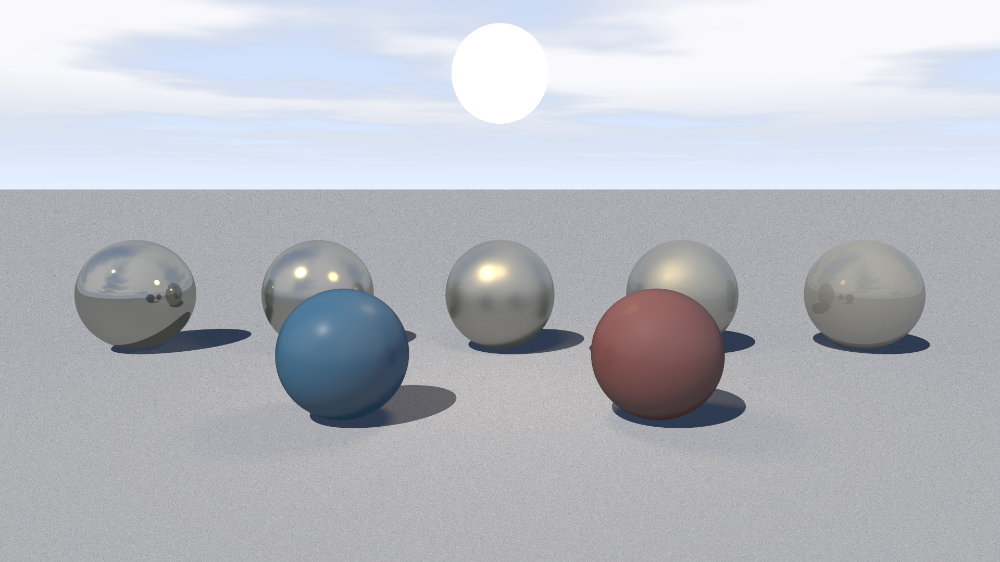
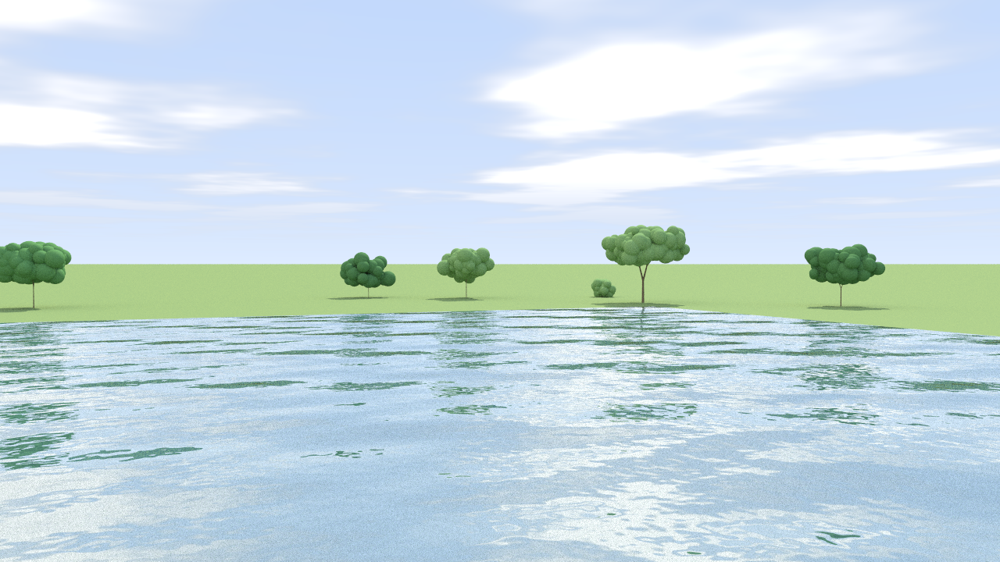
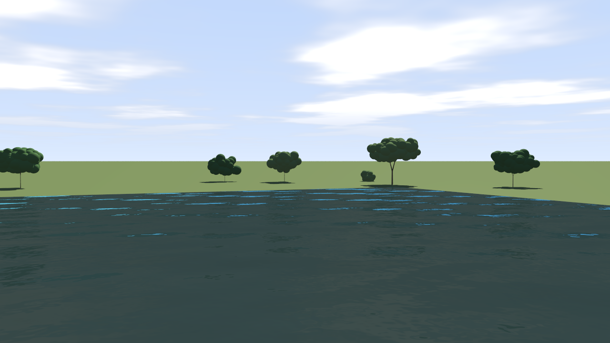
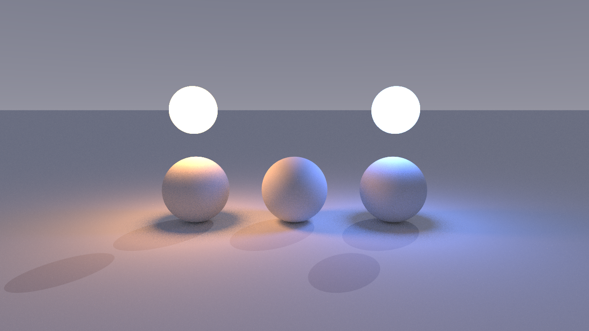
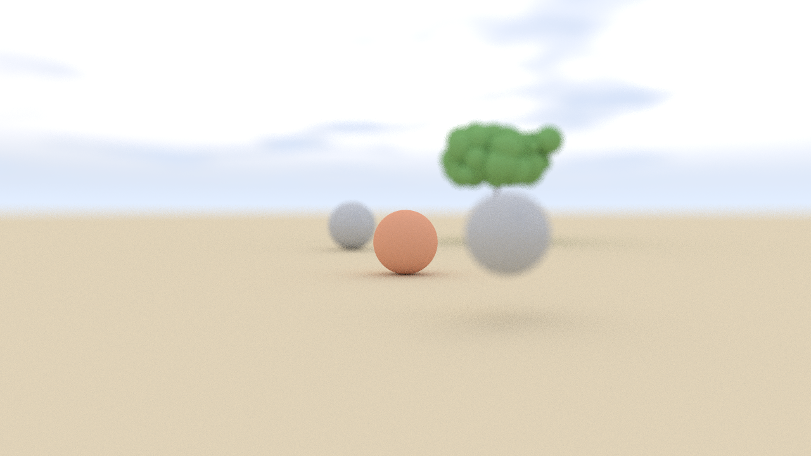

# Marmel-trace — A Path/Raytracer written in C

A from-scratch pathtracer/raytracer written in C11. **By default it renders with an unbiased
path tracer (global illumination), adaptive sampling and multithreading all ON**;
each of these is an opt-*out* (`--no-pathtrace`, `--no-adaptive`, `--no-threads`), and
the original Whitted-style recursive renderer remains available via `--no-pathtrace`.
It renders a
photorealistic outdoor scene — procedurally grown trees and bushes, a reflective and
refractive pond with a wave-perturbed surface, and a procedural sky with fBm clouds —
and writes the result as a 24-bit uncompressed BMP or a binary PPM (P6) file. The
renderer uses a thin-lens camera (pinhole by default), stratified jittered
anti-aliasing, sun-disk-sampled soft shadows (hard by default), recursive
reflection/refraction with Schlick–Fresnel weighting (including total internal
reflection), per-material procedural textures, and a binned-SAH BVH for nearest-hit
acceleration. The scene itself is **data-driven**: it is described by a human-editable
text document that the renderer parses at startup. It has **zero third-party
dependencies**: C11 and `libm` only.


Examples:

Physically Based Rendering materials



Pathtracing



Raytracing


Emitters


Soft shadows / Aperture


---

## Features

- **Data-driven scene** — camera, sky, materials, primitives and procedural
  trees/bushes are described in a text file read at startup (see
  [Scene files](#scene-files)). The default scene is embedded in the binary, so the
  program runs standalone without any scene file or `scenes/` directory.
- **Recursive reflection/refraction** (Whitted-style), bounded by a configurable depth limit.
- **Schlick Fresnel** weighting between reflected and refracted energy (`F0 ≈ 0.02` for water),
  evaluated at the refracted cosine, with explicit **total internal reflection (TIR)** detection.
- **Beer–Lambert water absorption** — `water_attenuate` blends the transmitted colour
  per channel toward a deep-water colour via `exp(-absorption · depth)` transmittance.
- **Blinn–Phong shading** with a half-vector specular term and shadow rays against the sun.
- **Opt-in physically-based (PBR) materials** — a per-material `pbr = 1` gate swaps the
  direct-sun term for an energy-conserving metallic/roughness **Cook-Torrance microfacet**
  model (GGX normal distribution, Smith-Schlick-GGX visibility, Schlick Fresnel,
  `F0 = mix(0.04, albedo, metallic)`, and a `(1 − metallic)` π-consistent Lambert diffuse
  lobe). Driven by the new per-material keys `metallic` (0..1), `roughness` (0..1) and
  `emissive` (linear RGB, added once per shaded hit, may exceed 1). All default to the
  legacy Blinn–Phong path, so existing scenes are unaffected. Fifteen named `type = …`
  presets are provided (seven conductors, four dielectrics including `diamond`, an
  `emissive` lamp, and the legacy `water`/`opaque`/`glass`) — see the scene-format
  summary below. The diffuse lobe is weighted by `kD = (1 − F)(1 − metallic)` (with `F`
  the Schlick Fresnel term), so the model is **energy-conserving**.
- **Glossy (roughness-blurred) reflections** — when a PBR material has
  `reflectivity > 0` and `roughness > 0`, the recursive mirror pass casts 16
  importance-sampled GGX rays (`alpha = max(roughness², 1e-4)`) and averages them instead
  of a single sharp mirror ray; `roughness ≈ 0` (or a non-PBR material) falls back to the
  exact legacy mirror. Driven by the existing `pbr`/`reflectivity`/`roughness` keys — no
  new scene key.
- **Emissive area lights** — an emissive PBR primitive (non-zero `emissive`) now acts as a
  sampled **area light**: up to eight emissive spheres are collected at build time and the
  renderer samples each lamp's visible cap (16 cone samples), so emitters illuminate and
  colour-tint the surrounding geometry with distance falloff. Driven by the existing
  `pbr`/`emissive` keys — no new scene key.
- **Adaptive sampling (ON by default, opt out with `--no-adaptive`)** — refines a pixel
  while its relative standard error of the mean luminance (Rec. 709) exceeds
  `--adaptive-tau` (default `0.02`), spending up to `--adaptive-max` samples (default
  `4 × --samples`) on noisy/high-contrast pixels and stopping early on flat ones.
  Adaptive sampling applies to the **Whitted renderer only**; it is ignored by the path
  tracer. Pass `--no-adaptive` to fall back to the fixed per-pixel sample count.
- **Path tracing / global illumination (ON by default, opt out with `--no-pathtrace`)** —
  the default renderer is an unbiased **unidirectional path tracer**: an iterative
  (non-recursive) bounce loop up to `--depth` accumulates throughput-weighted radiance,
  using cosine-weighted hemisphere sampling for diffuse, Schlick-Fresnel reflect/refract
  for mirror/glass/water, and a mixed diffuse + GGX specular lobe for PBR materials. Next
  Event Estimation (sun plus emissive area lights) and unbiased Russian Roulette keep it
  efficient and correct. Passing `--no-pathtrace` selects the legacy Whitted-style
  renderer instead; the exact **byte-identical** fixed-spp Whitted output of previous
  releases is reproduced with `--no-pathtrace --no-adaptive`.
- **Render progress meter** — a thread-safe one-line meter on **stderr**
  (`render:  42% [00:12<00:16, 1.2 Mpx/s]`) showing percentage, elapsed time, throughput
  and ETA; throttled to ~120 ms, present in **both** the single-threaded and threaded
  builds, and silenced with `RAYTRACER_NO_PROGRESS=1`.
- **Soft shadows** via sun-disk sampling: the `sky` key `sun_radius` (degrees) turns the
  sun into a finite disk and averages the unoccluded fraction over a cone, producing
  penumbrae; `sun_radius = 0` (the default) keeps the original single hard-shadow ray.
- **Depth of field** via a thin-lens camera: the `camera` keys `aperture` (lens radius,
  `0` = pinhole, the default) and `focus_distance` focus a chosen plane and blur
  nearer/farther geometry.
- **Procedural textures per material**: the `material` keys `texture = none|checker|stripes`,
  `texture_scale`, `texture_color_a`, `texture_color_b` modulate albedo by a world-space
  positional pattern (default `none`, a no-op).
- **Procedural sky**: horizon→zenith gradient, a tight sun glow, and **fBm cloud** layer on a horizontal plane.
- **Procedural trees**: recursive branching of tapered-cylinder segments ending in leaf-cluster spheres; deterministic per seed.
- **File-controllable plant generator**: each `tree`/`bush` may override the ten generator
  keys `max_depth`, `min_branch_radius`, `taper`, `len_decay`, `spread_deg`, `perturb_deg`,
  `up_bias`, `third_child_chance`, `leaf_min`, `leaf_span` (omitted keys use the built-in
  `SCENE_*` defaults).
- **Supersampled anti-aliasing**: stratified jittered sampling when the sample count is a perfect square, uniform jitter otherwise.
- **BVH acceleration**: binned surface-area-heuristic build with a median-split fallback, flat node array.
- **Multithreading via `pthread`, ON by default** — the default `make` build is threaded
  (`-DUSE_PTHREADS -pthread`); the image is rendered with **dynamic tile scheduling**, and
  the worker count is controlled by the `RAYTRACER_THREADS` environment variable. Opt out
  at runtime with `--no-threads` (alias `--single-threaded`), or build a serial binary
  with `make serial` / `make no-threads`. The renderer builds and runs correctly without
  pthread.
- **Deterministic** output for a given scene and seed — no `rand()`, no `time()` in the render path.
- **Zero third-party dependencies** (C11 + `libm` only).
- **24-bit BMP or binary PPM (P6) output** — BMP is the default (`BITMAPINFOHEADER`,
  bottom-up, BGR, 4-byte row padding); `--out *.ppm` writes a top-down RGB PPM (P6).

---

## Requirements

- A C11 compiler — `clang` or `gcc`.
- `make`.
- No external libraries (only the C standard library and `libm`).

---

## Build

```sh
make            # DEFAULT build: threaded (-DUSE_PTHREADS -pthread)
make serial     # serial opt-out build (no pthread); alias: make no-threads
make threads    # threaded build (backward-compatible alias for the default)
make clean      # remove build artifacts and binaries
```

`make` now builds the **threaded** binary by default. Use `make serial` (or its alias
`make no-threads`) for a serial build without pthread; `make threads` is kept as an
alias for the default. Threading can also be toggled with `THREADS=0`, e.g.
`make all THREADS=0`. The build rules live in the project `Makefile`.

---

## Usage

| Option | Argument | Description | Default |
| --- | --- | --- | --- |
| `--width` | `N` | Output image width in pixels (must be > 0). | `1280` |
| `--height` | `N` | Output image height in pixels (must be > 0). | `720` |
| `--samples` | `N` | Anti-aliasing samples per pixel (must be ≥ 1). | `16` |
| `--depth` | `N` | Maximum reflection/refraction depth (must be ≥ 0). | `6` |
| `--seed` | `N` | Root scene seed (must be ≥ 0). | `1337` |
| `--out` | `PATH` | Output image path (must not be empty). Writes a binary **PPM (P6)** when `PATH` ends in `.ppm` (case-insensitive); otherwise writes a 24-bit uncompressed **BMP**. | `output/scene.bmp` |
| `--scene` | `PATH` | Load and render a scene description file (must not be empty). | embedded default |
| `--write-scene` | `PATH` | Write the default scene description to `PATH` and exit without rendering. | — |
| `--threads` | — | Multithreading is **ON by default** in the threaded build; this flag is accepted for compatibility (a no-op) and is ignored with a note on stderr in a serial build. | on |
| `--no-threads` / `--single-threaded` | — | Force **single-threaded** rendering at runtime, even in a threaded build. | off |
| `--adaptive` | — | Adaptive sampling is **ON by default**; this flag is accepted for compatibility (a no-op). It refines a pixel while its relative standard error of the mean luminance exceeds `--adaptive-tau`, up to `--adaptive-max` samples. Applies to the **Whitted renderer only** (ignored by the path tracer). | on |
| `--no-adaptive` | — | Disable adaptive sampling and use the fixed per-pixel sample count (combine with `--no-pathtrace` for the exact legacy fixed-spp Whitted output). | off |
| `--adaptive-max` | `N` | Maximum samples per pixel in adaptive mode (must be ≥ 1). | `4 × --samples` |
| `--adaptive-tau` | `T` | Relative-error tolerance in adaptive mode (must be > 0). | `0.02` |
| `--pathtrace` | — | The **unbiased path tracer** (global illumination) is **ON by default**; this flag is accepted for compatibility (a no-op). Bounces up to `--depth` and accumulates `--samples` paths per pixel. | on |
| `--no-pathtrace` | — | Select the legacy **Whitted-style renderer** instead of the path tracer. Combine with `--no-adaptive` to reproduce the exact **byte-identical** fixed-spp output of previous releases. | off |
| `--no-progress` | — | Silence the stderr render progress meter (same as setting `RAYTRACER_NO_PROGRESS`). | off |
| `--help`, `-h` | — | Print usage and exit. | — |

Both `--opt value` and `--opt=value` forms are accepted. The CLI is defined in
`src/main.c`; run `--help` for the same list at runtime:

```text
Usage: ./raytracer [options]

Options:
  --width N      image width in pixels   (default 1280, must be > 0)
  --height N     image height in pixels  (default 720, must be > 0)
  --samples N    samples per pixel       (default 16, must be >= 1)
  --depth N      max recursion depth     (default 6, must be >= 0)
  --seed N       scene seed              (default 1337)
  --out PATH     output image path; BMP, or PPM if PATH ends in .ppm
                 (default "output/scene.bmp")
  --scene PATH   load a scene description file (default: embedded scene)
  --write-scene PATH
                 write the default scene description to PATH and exit
  --threads / --no-threads (alias --single-threaded)
                 multithreading is ON by default (threaded build);
                 --no-threads forces single-threaded rendering
  --adaptive / --no-adaptive
                 adaptive sampling is ON by default (Whitted renderer
                 only); spends more samples on noisy pixels, fewer on
                 flat ones; --no-adaptive disables it
  --pathtrace / --no-pathtrace
                 unbiased path tracer (global illumination) is ON by
                 default; --no-pathtrace selects the legacy Whitted
                 renderer
  --adaptive-max N
                 max samples per pixel in adaptive mode (default 4*N)
  --adaptive-tau T
                 relative-error tolerance in adaptive mode (default 0.02)
  --no-progress  silence the stderr render progress meter
                 (same as setting RAYTRACER_NO_PROGRESS)
  --help, -h     print this usage and exit

The scene description format is documented in docs/scene_format.md.
Both `--opt value` and `--opt=value` forms are accepted.
```

**Exit codes.** `0` on success; `2` on a CLI-usage error (unknown option, missing
value, empty path, out-of-range number); `1` when the scene cannot be loaded (for
example `--scene missing.scene` prints
`error: cannot load scene 'missing.scene': missing.scene:1: error: cannot open: No such file or directory (near '<eof>')`)
or when rendering/writing fails. Diagnostics go to **stderr**.

Examples:

```sh
# Default 1280x720 render of the embedded scene to output/scene.bmp.
# This now path-traces (global illumination) with adaptive sampling and
# multithreading ON by default.
./raytracer

# Legacy Whitted-style renderer (opt out of path tracing)
./raytracer --no-pathtrace --out output/whitted.bmp

# Exact legacy fixed-spp Whitted output (byte-identical to previous releases):
# opt out of BOTH the path tracer and adaptive sampling
./raytracer --no-pathtrace --no-adaptive --out output/legacy.bmp

# Force single-threaded rendering
./raytracer --no-threads --out output/scene.bmp

# Fast preview at low resolution and sample count
./raytracer --width 320 --height 180 --samples 4 --out preview.bmp

# Same preview written as a binary PPM (P6) instead of BMP
./raytracer --width 320 --height 180 --samples 4 --out preview.ppm

# Render a described scene (see Scene files below)
./raytracer --scene scenes/example_sunset.scene --out output/sunset.bmp

# Dump the built-in default scene description and exit
./raytracer --write-scene scenes/default.scene

# High-quality render with more bounces and a different tree layout
./raytracer --width 1920 --height 1080 --samples 64 --depth 8 --seed 42 --out output/scene_hq.bmp

# Multithreaded render with an explicit worker count (threaded build is the default)
RAYTRACER_THREADS=8 ./raytracer --width 1920 --height 1080 --samples 64

# Adaptive sampling is ON by default; tune it, or disable it with --no-adaptive
./raytracer --scene scenes/example_adaptive.scene --samples 8 \
    --adaptive-tau 0.02 --adaptive-max 32 --out output/adaptive.bmp
./raytracer --scene scenes/example_adaptive.scene --samples 8 --no-adaptive \
    --out output/adaptive_off.bmp

# Glossy reflections and emissive area lights are driven by the scene's materials
./raytracer --scene scenes/example_glossy.scene --out output/glossy.bmp
./raytracer --scene scenes/example_emitters.scene --out output/emitters.bmp

# Unbiased path tracing (global illumination) is the default; 256 paths/pixel, 6 bounces
./raytracer --scene scenes/example_pathtrace.scene --samples 256 \
    --depth 6 --out output/pathtrace.bmp

# Path tracing also honours RAYTRACER_THREADS in the threaded build
RAYTRACER_THREADS=8 ./raytracer --scene scenes/example_pathtrace.scene \
    --samples 512 --depth 8 --out output/pathtrace_hq.bmp
```

Rendering progress is written to **stderr** only (so stdout is never polluted). A
single self-overwriting line reports the completion percentage, elapsed time, throughput
and estimated time remaining, e.g. `render:  42% [00:12<00:16, 1.2 Mpx/s]`. It is
redrawn at most every ~120 ms, always finishes with a final `100%` line, and is present
in **both** the single-threaded and the `-DUSE_PTHREADS` builds (the threaded build
derives it from an atomic completed-tiles counter, so the workers never interleave).
Set the environment variable `RAYTRACER_NO_PROGRESS=1` (or pass `--no-progress`) to
silence it; this works in both builds. Progress is purely diagnostic and never affects
the rendered pixels or determinism — see [`docs/render_notes.md`](docs/render_notes.md).

### `RAYTRACER_THREADS`

In a `-DUSE_PTHREADS` build only, `RAYTRACER_THREADS` overrides the worker count:

- If set to a decimal integer in `[1, 64]`, that many worker threads are used.
- Any other non-empty value (out of range, or not a number) falls back to **1** thread.
- If unset or empty, the count defaults to the number of **online CPUs**
  (`sysconf(_SC_NPROCESSORS_ONLN)`), or `4` if that count is unavailable,
  clamped to `[1, 64]`.
- The count is further clamped so no more threads are spawned than there are tiles.

Because each pixel's colour is a pure function of `(x, y, sample index)`, the output is
**byte-identical for any thread count** — `RAYTRACER_THREADS` only affects speed.

---

## Scene files

The scene is **data-driven**: at startup the renderer obtains a scene *description* and
builds the geometry from it. There is a **single construction path** — the previously
hardcoded scene builder `scene_build()` has been **REMOVED**. `scene_build_from_desc()`
(in `src/scene.c`) is now the only way a scene is built, and it is driven entirely by
the parsed description.

The description comes from one of two sources:

1. `--scene PATH` — parse the text file at `PATH` and render it.
2. no `--scene` — use the built-in default description (see
   [Embedded default & fallback](#embedded-default--fallback)).

The format is line-oriented and human-editable; the authoritative grammar is frozen in
`docs/scene_format.md`. The parser is implemented in `src/scene_desc.c` and the
canonical writer in `src/scene_desc_write.c`.

### Format summary

- **Line-oriented.** Exactly one statement per physical line. `#` starts a comment
  (whole-line or trailing). Blank lines are ignored. Both LF and CRLF line endings are
  accepted, and a final newline is optional.
- **Two statement forms:**
  - a **block header**: `keyword {` or `keyword <name> {` (the `{` is on the same line);
  - a **key/value line** inside a block: `key = value`.
  A closing `}` sits on its own line.
- **Exactly one nesting level.** Blocks do not nest; a block body contains only
  `key = value` lines (plus blank/comment lines).
- **Blocks:** `camera` (at most one), `sky` (at most one), `material <name>`
  (repeatable, names must be unique), the primitives
  `sphere`, `plane`, `box`, `triangle`, `cylinder` (repeatable), and the procedural
  directives `tree` and `bush` (repeatable).
- **New optional keys** (all default to the previous behaviour, so existing scenes and
  the built-in default are unchanged):
  - `material`: `texture = none|checker|stripes`, `texture_scale`, `texture_color_a`,
    `texture_color_b` — world-space procedural albedo patterns (see §4.3 of
    `docs/scene_format.md`).
  - `material`: `pbr` (opt-in gate), `metallic` (0..1), `roughness` (0..1) and
    `emissive` (linear RGB) — the opt-in physically-based metallic/roughness layer
    (see §4.3 of `docs/scene_format.md`); also `type = <name>` named presets
    (`water`, `opaque`, `glass`, `gold`, `copper`, `silver`, `aluminum`, `iron`,
    `chrome`, `brass`, `plastic`, `rubber`, `ceramic`, `diamond`, `emissive`).
    These same keys also drive two further opt-in behaviours — no new key is
    required: a PBR material with `reflectivity > 0` and `roughness > 0` gets
    **roughness-blurred (glossy) reflections**, and a PBR material with a non-zero
    `emissive` acts as a sampled **area light** that illuminates and colour-tints
    other geometry.
  - `sky`: `sun_radius` (degrees; `0` = hard shadow, the default) — sun-disk soft shadows.
  - `camera`: `aperture` (lens radius; `0` = pinhole, the default) and `focus_distance`
    (world units; `0` derives `|target - eye|`) — thin-lens depth of field.
  - `tree`/`bush`: `max_depth`, `min_branch_radius`, `taper`, `len_decay`, `spread_deg`,
    `perturb_deg`, `up_bias`, `third_child_chance`, `leaf_min`, `leaf_span` — per-plant
    generator overrides.
    The authoritative grammar, types, ranges and defaults for every key live in
    [`docs/scene_format.md`](docs/scene_format.md).
- **Top-level globals** (no braces): `water_level`, `water_material`, `water_enabled`.
- **Values** are a scalar (`shininess = 256`), a whitespace-separated **vec3**
  (`albedo = 0.30 0.42 0.16`), an integer, a boolean flag (`0`/`1`), a material name
  reference (`material = water`), or a double-quoted string. Commas and semicolons are
  **not** allowed.
- **Keywords and keys are case-sensitive lower-case.** Material names are case-sensitive.
- **Required keys:** `sphere` needs `center`, `radius`, `material`; `plane` needs
  `point`, `normal`, `material`; `box` needs `center`, `half`, `material`; `triangle`
  needs `a`, `b`, `c`, `material`; `cylinder` needs `base`, `top`, `r_bottom`, `r_top`,
  `material`; `tree`/`bush` need `position`, `height`. Camera, sky and material keys are
  all optional (each has a default). Every material referenced must be declared.
- **Errors** are reported as `FILE:LINE: error: MESSAGE (near 'TOKEN')` and cause a
  non-zero exit; unknown keys are tolerated with a warning.

Primitive order in the file determines the internal `prim_index` order (and therefore
the BVH tie-break), so re-ordering blocks can change tie-breaks. A `tree`/`bush`
directive expands in place into its branch cylinders and leaf spheres.

### Complete worked example

The following file is valid under the frozen spec. It exercises every block type
(camera, sky, materials including the `type = water` shorthand, all five primitives,
and the procedural `tree`/`bush` directives).

```text
# A complete worked example: a pond with a tree, a rock and a bush.
# Comments start with '#'; blank lines are ignored.

# ---- Top-level globals ---------------------------------------------------
water_level = 0.02
water_material = water
water_enabled = 1

# ---- Camera --------------------------------------------------------------
camera {
    eye = -18 6 22
    target = 0 5 -20
    up = 0 1 0
    vfov = 40
}

# ---- Sky -----------------------------------------------------------------
sky {
    sun_dir = 0.45 0.75 -0.50
    sun_color = 1 0.95 0.85
    horizon_color = 0.75 0.85 1
    zenith_color = 0.35 0.55 0.95
    gradient_gamma = 0.6
    sun_glow_exponent = 350
    sun_glow_strength = 0.8
    cloud_height = 120
    cloud_scale = 0.0025
    cloud_coverage = 0.5
    cloud_softness = 0.12
    cloud_sharpness = 1.5
    cloud_octaves = 5
}

# ---- Materials -----------------------------------------------------------
material ground {
    albedo = 0.30 0.42 0.16
    specular = 0.05 0.05 0.05
    shininess = 8
    reflectivity = 0
    ior = 1
}

material bark {
    albedo = 0.26 0.18 0.11
    specular = 0.04 0.04 0.04
    shininess = 6
}

material leaf {
    albedo = 0.20 0.42 0.14
    specular = 0.03 0.04 0.03
    shininess = 10
}

# The water preset fills in albedo/specular/ior/is_water/absorption/...
material water {
    type = water
}

# ---- Primitives ----------------------------------------------------------
plane {
    point = 0 0 0
    normal = 0 1 0
    material = ground
}

# Pond: a very flat box whose top face sits at water_level (0.02).
box {
    center = 0 -0.01 -25
    half = 45 0.03 45
    material = water
}

sphere {
    center = 6 1.0 -8
    radius = 1.0
    material = ground
}

triangle {
    a = 0 0 0
    b = 2 0 0
    c = 0 2 0
    material = bark
}

cylinder {
    base = 3 0 3
    top = 3 4 3
    r_bottom = 0.3
    r_top = 0.2
    material = bark
}

# ---- Procedural plants ---------------------------------------------------
tree {
    position = 50 0 -80
    height = 3.4
    radius = 0.2
    seed = 12345
    material_bark = bark
    material_leaf = leaf
    leaf_variant = 1
}

bush {
    position = -48 0 -55
    height = 0.8
    radius = 0.05
    material_bark = bark
    material_leaf = leaf
}
```

Save it to a file and render it with, for example,
`./raytracer --scene my.scene --width 320 --height 180 --samples 4 --out out.bmp`.

### `scenes/` examples

- **`scenes/default.scene`** — the built-in default scene (the outdoor scene with six
  trees, two bushes, the ground plane and the pond box), written in the same format.
  Its body is exactly what `--write-scene` emits, so rendering it is byte-identical to
  rendering with no `--scene` at all. Render it with
  `./raytracer --scene scenes/default.scene`.
- **`scenes/example_sunset.scene`** — a small, hand-written, heavily commented scene
  demonstrating customisation: a warm sunset sky (low, red-shifted sun; orange horizon;
  deep blue zenith), two custom materials (`sand`, `stone`) plus a custom green pond
  material, and a ground plane, pond box, two spheres and one small tree. Render it with
  `./raytracer --scene scenes/example_sunset.scene --out output/sunset.bmp`.
- **`scenes/example_checkerboard.scene`** — showcases the procedural **textures**: a
  checkerboard floor (`texture = checker`), a striped sphere (`texture = stripes`) and one
  plain untextured cube for contrast, under a clear day sky. Render it with
  `./raytracer --scene scenes/example_checkerboard.scene --width 320 --height 180 --samples 8 --out output/checkerboard.bmp`.
- **`scenes/example_softshadow.scene`** — showcases **soft shadows** (`sky.sun_radius = 6`)
  and **depth of field** (`camera.aperture = 0.35`, `focus_distance = 24`): three spheres
  and a tree at different eye distances sit at the focal plane or out of focus; the near
  sphere and the tree float above the sand so their cast shadows show a visible penumbra,
  while the focal-plane sphere sits on the ground. Render it with
  `./raytracer --scene scenes/example_softshadow.scene --width 320 --height 180 --samples 16 --out output/softshadow.bmp`.
- **`scenes/example_customtree.scene`** — demonstrates the **file-controllable tree/bush
  generator** parameters: three plants (a tall sparse tree, a short bushy tree, a compact
  bush) each set their own `max_depth`, `taper`, `spread_deg`, `third_child_chance`,
  `leaf_min`, … to grow visibly different silhouettes. Render it with
  `./raytracer --scene scenes/example_customtree.scene --width 320 --height 180 --samples 8 --out output/customtree.bmp`.
- **`scenes/example_glass.scene`** — demonstrates the **general refraction / glass**
  material support: a clear `type = glass` refracting lens, a `beer_lambert = 1` tinted
  glass with per-channel depth absorption, and a custom high-`ior` (`2.4`) diamond-like
  lens. Render it with
  `./raytracer --scene scenes/example_glass.scene --width 320 --height 180 --samples 8 --out output/glass.bmp`.
- **`scenes/example_materials.scene`** — demonstrates the **opt-in PBR metallic/roughness
  layer** driven directly by the four `material` keys (`pbr`, `metallic`, `roughness`,
  `emissive`): a row of gold conductors whose `roughness` ramps `0.05 → 0.9`, two coloured
  dielectrics, and a floating warm-white emitter, over a checkerboard floor. Render it with
  `./raytracer --scene scenes/example_materials.scene --width 320 --height 180 --samples 8 --out output/materials.bmp`.
- **`scenes/example_presets.scene`** — showcases the fifteen named `type = <name>`
  **material presets** (the seven conductors, the four dielectrics, `diamond` and
  `emissive`), including a preset-plus-override (`type = gold` with `roughness = 0.30`) and
  a stronger lamp (`emissive = 4.0 3.4 2.6`). Render it with
  `./raytracer --scene scenes/example_presets.scene --width 320 --height 180 --samples 8 --out output/presets.bmp`.
- **`scenes/example_glossy.scene`** — showcases **roughness-blurred (glossy) metal
  reflections**: a roughness ramp across gold, chrome and copper conductors (all with
  `reflectivity = 0.8`) blurs the recursive environment reflection from a near-mirror to a
  broad satin sheen, using only the existing `pbr`/`roughness`/`reflectivity` keys. Render
  it with
  `./raytracer --scene scenes/example_glossy.scene --out output/glossy.bmp`.
- **`scenes/example_emitters.scene`** — showcases **emissive PBR primitives as area
  lights**: a warm amber lamp and a cool blue lamp light a deliberately dim dusk scene,
  brightening the grey spheres beneath them and colour-bleeding across the floor, driven
  by the existing `pbr`/`emissive` keys. Render it with
  `./raytracer --scene scenes/example_emitters.scene --out output/emitters.bmp`.
- **`scenes/example_adaptive.scene`** — a high-contrast scene (21 overlapping spheres,
  thin needles/blades, hard shadows and strong depth of field) built to showcase
  **adaptive sampling** (ON by default; opt out with `--no-adaptive`): flat floor/sky
  regions keep the base sample count while noisy,
  high-contrast detail is refined. Render it with
  `./raytracer --scene scenes/example_adaptive.scene --samples 8 --out output/adaptive.bmp`.
- **`scenes/example_pathtrace.scene`** — showcases the **unbiased path tracer /
  global illumination** (ON by default; opt out with `--no-pathtrace`): an indoor-style
  scene where diffuse
  inter-reflection and coloured bounce light from the emissive lamps are visible only in
  path-trace mode. Render it with
  `./raytracer --scene scenes/example_pathtrace.scene --samples 256 --depth 6 --out output/pathtrace.bmp`.

### Embedded default & fallback

The default scene is **compiled into the binary**, so the program works standalone
without the `scenes/` directory:

- **`src/default_scene_text.h`** holds `DEFAULT_SCENE_TEXT`, the default scene in
  the on-disk description format. `src/main.c` `#include`s this header, so the text
  is embedded in the binary; when `--scene` is absent, `main` parses that text at
  runtime with `scene_desc_load_string()` and builds the scene with
  `scene_build_from_desc()`. A parse failure (which should be impossible) is
  reported and exits non-zero rather than crashing.
- `scenes/default.scene` is the on-disk form of that same text, **byte-for-byte
  identical** to `DEFAULT_SCENE_TEXT`, so rendering it is byte-identical to
  rendering with no `--scene` at all.
- `scene_default_desc()` (in `src/scene.c`) constructs the same default description
  in memory; it is used by the test suite and by `--write-scene`.
- `--write-scene PATH` dumps that same default description to `PATH` and exits `0`
  without rendering — handy for producing a starting point to edit.

---

## Output

The output format is chosen from the `--out` path extension: `.ppm` (case-insensitive)
selects the binary PPM (P6) writer, and any other extension selects the BMP writer.
`output/scene.bmp` is the default.

### BMP (default)

The renderer writes a **24-bit uncompressed BMP**:

- `BITMAPFILEHEADER` (14 bytes) + `BITMAPINFOHEADER` (40 bytes), `bfOffBits = 54`.
- 1 plane, 24 bits per pixel, `BI_RGB` (no compression).
- **Bottom-up** row order, **BGR** channel order, rows padded to a 4-byte boundary
  (`row_size = ((width*3 + 3) / 4) * 4`), and `bfSize = 54 + row_size*height`.
- All multi-byte fields are serialized explicitly as little-endian, so output is
  correct regardless of host endianness or struct layout.

The in-memory render buffer is top-down row-major **RGB**; the BMP writer performs the
row flip and RGB→BGR conversion.

### PPM (binary P6)

When the path ends in `.ppm`, the renderer writes a **binary PPM (P6)** file:

- A plain-ASCII header `P6\n<width> <height>\n255\n` followed by the raw pixel bytes.
- 8 bits per channel, **RGB** channel order, **top-down** row-major, with **no padding**
  between rows (exactly `width * height * 3` pixel bytes).
- P6 is natively top-down RGB, so — unlike the BMP writer — no row flip or channel
  conversion is required: the render buffer is emitted verbatim after the header.

---

## Architecture

| Module | Responsibility |
| --- | --- |
| `src/vec3.{h,c}` | Double-precision `Vec3` and `Ray` types; vector arithmetic, dot/cross, normalize, `reflect`, `refract`. |
| `src/camera.{h,c}` | Thin-lens / pinhole camera with an orthonormal look-at basis; `camera_ray` generates normalized primary rays, with deterministic lens-disk jitter for depth of field. |
| `src/bmp.{h,c}` | `bmp_write`: 24-bit uncompressed BMP serialization (header, row flip, BGR, padding); `ppm_write`: binary PPM (P6) serialization (ASCII header + raw top-down RGB). |
| `src/texture.{h,c}` | Procedural, world-space positional albedo textures (`none`/`checker`/`stripes`) evaluated per hit. |
| `src/noise.{h,c}` | Deterministic value noise, Perlin gradient noise, fBm and turbulence (no global state). |
| `src/geometry.{h,c}` | Primitives (sphere, infinite plane, AABB box, triangle, finite capped tapered cylinder) with intersection routines and per-primitive AABB bounds. |
| `src/bvh.{h,c}` | Binned-SAH bounding volume hierarchy over a `Geometry`; flat node array holding indices only. |
| `src/material.{h,c}` | `Material` and `SkyParams`; Schlick Fresnel, Blinn–Phong local shading, opt-in Cook-Torrance PBR (`material_shade_pbr`), glossy GGX reflection sampling (`material_sample_glossy_dir`), area-light cone sampling (`light_sphere_sample_dir`), hemisphere ambient, `sky_sample`, `water_normal`, `water_attenuate`. |
| `src/scene_desc.{h,c}` | Scene-description data model and parser (`scene_desc_load`, `scene_desc_load_string`); `src/scene_desc_write.c` emits the canonical text (`scene_desc_write`). |
| `src/scene.{h,c}` | `scene_build_from_desc` (the **single** construction path), `scene_default_desc` (built-in default), BVH build, `scene_intersect` / `scene_material`, and `scene_collect_emissive_lights` (up to `SCENE_MAX_EMISSIVE_LIGHTS` emissive PBR spheres promoted to area lights). The old hardcoded `scene_build()` has been removed. |
| `src/default_scene_text.h` | Generated header holding `DEFAULT_SCENE_TEXT`, the default scene in description format (byte-identical to `scenes/default.scene`); `#include`d by `src/main.c` and parsed at runtime by `scene_desc_load_string` when `--scene` is absent. |
| `src/render.{h,c}` | `render_image` / `render_image_ex`: pixel loop, anti-aliasing, recursive `trace` (with glossy reflection and emissive area-light direct terms), sun-disk-sampled shadow rays (hard or soft), gamma correction, pthread parallelism with tile scheduling (default-ON, opt out with `--no-threads`), adaptive refinement (default-ON for Whitted, opt out with `--no-adaptive`), and the stderr progress meter. |
| `src/main.c` | CLI entry point: parses options, loads the scene description, builds the scene and camera, renders, writes the BMP or PPM (P6) selected by the `--out` extension, prints timing. |

---

## How it works

**Primary rays and anti-aliasing.** For each pixel `(x, y)` the renderer takes
`samples` sub-pixel samples. When `samples` is a perfect square it uses a stratified
`g × g` grid with a jittered offset in each cell; otherwise it uses uniformly jittered
offsets. Each sample maps to normalized image coordinates `(u, v)` with `v` increasing
upward and `u` to the right, and `camera_ray` returns a normalized primary ray. With a
non-zero `camera.aperture` the camera is a thin-lens model: the ray origin is jittered to
a point on the lens disk and aimed at where the pinhole ray crosses the focal plane at
`focus_distance`, giving depth of field (aperture `0` reproduces the ideal pinhole). The
jitter comes from a small integer-hash PRNG seeded from `(x, y, sample index)` — with
dedicated channels for the lens offset — so the whole frame is reproducible and never
touches `rand()` or the clock.

**Traversal and nearest hit.** Rays are intersected against the scene through the BVH,
which is built once with a binned surface-area heuristic (12 bins along the widest axis
of each node's centroid bounds) and a median-split fallback when the SAH split does not
beat making a leaf. Traversal returns the nearest hit within `[1e-4, ∞)`. Hit records
carry the distance `t`, the world-space point, a unit normal oriented to oppose the
incoming ray, the material index, the primitive index, and a `front_face` flag.

**Local shading and shadows.** At a hit, the surface normal `N`, the view vector
`V = -ray.dir`, and the sun direction `L` drive Blinn–Phong shading:
`diffuse = albedo · light · max(0, N·L)` plus a specular term
`specular · light · (N·H)^shininess` with half-vector `H = normalize(L + V)`. The albedo
may be modulated by the material's **procedural texture** evaluated at the world-space hit
point (the specular tint is used unchanged). A shadow ray is cast from a
slightly offset origin toward the sun; if anything blocks it, only the hemisphere ambient
term remains. With the default `sky.sun_radius = 0` this is a single **hard** shadow ray;
when `sun_radius > 0` the direct sunlight is instead sampled over a cone of that angular
half-angle with a fixed number of rays per lit hit, and the **unoccluded fraction** is
averaged to produce a soft (penumbral) shadow. The cone samples are deterministic,
derived only from the pixel and sample indices. Ambient is a cheap two-color
hemisphere blend between a ground-ish color and the sky's zenith color, scaled down so
unlit regions stay dark but readable. When a material sets `pbr = 1`, the direct-sun term
is instead evaluated with the energy-conserving Cook-Torrance microfacet model described
in `docs/render_notes.md`; the legacy Blinn–Phong term is otherwise untouched.

**Reflection, refraction, and Fresnel.** The recursive path uses Schlick's
approximation `F = F0 + (1 - F0)(1 - cos θ)^5`, with `F0 = ((1 - ior)/(1 + ior))²`
(about 0.02 for water). A mirror ray is traced along `reflect(dir, N)`. When the material
is PBR (`pbr = 1`), has `reflectivity > 0` and a non-zero `roughness`, the mirror pass
instead casts 16 **glossy** rays importance-sampled from the material's GGX lobe
(`alpha = max(roughness², 1e-4)`) and averages them, blurring the reflection; a
`roughness ≈ 0` material (or a non-PBR material) keeps the exact single sharp mirror ray.
When the material is transmissive, the Fresnel term is evaluated at the **refracted** cosine
`cos θ_t` (via `sin²θ_t = eta²(1 - cos²θ_i)`) rather than the incident cosine; this
removes the non-physical discontinuity at the critical angle and lets the renderer
detect **total internal reflection** explicitly — when `sin²θ_t > 1` there is no
transmitted ray and all energy is reflected. Otherwise a refraction ray is traced with
`eta = 1/ior` on entry and `eta = ior` on exit, and the transmitted result is attenuated
with **Beer–Lambert** absorption via `water_attenuate` (see below). The two paths are
combined as `surface = F · reflection + (1 - F) · refraction`, then mixed into the local
color by the material's `transparency` (for water) or `reflectivity` (for mirrors).
Recursion stops when `depth > max_depth`, returning black.

**Emissive area lights.** At build time `scene_collect_emissive_lights` promotes up to
`SCENE_MAX_EMISSIVE_LIGHTS` (8) emissive PBR spheres, in file order, to a small light
list; a scene with no such material has a zero light count and the renderer's emissive
block is skipped entirely. When lights exist, each lit hit samples every lamp's visible
cap as a solid-angle cone (16 samples, `light_sphere_sample_dir`), casts a shadow ray per
sample and shades the receiver with the lamp's `emissive` colour, so brightness falls off
with distance and apparent size and coloured emitters tint nearby surfaces. This
direct-light term is **opt-in** and does not change a scene that has no emissive material.

**Adaptive sampling.** The fixed path takes exactly `--samples` samples per pixel. With
`--adaptive`, `render_image_ex` instead accumulates samples and stops once the relative
standard error of the mean luminance (Rec. 709) of the pixel falls below `--adaptive-tau`,
or when it reaches `--adaptive-max` samples (default `4 × --samples`); flat pixels
converge after the base count and noisy pixels keep refining. The sampler is fully
deterministic (the same hash-PRNG channels as the fixed path) and, when `--adaptive` is
absent, `render_image_ex` delegates verbatim to the fixed path, so the default render is
byte-identical.

**Render progress.** A single self-overwriting line is drawn to stderr at most every
~120 ms, reporting percentage, elapsed time, throughput and ETA; in the threaded build
progress is derived from an atomic completed-tiles counter with a single-writer gate so
the workers never interleave, and a final 100% line is always emitted. It is purely
diagnostic and never touches the pixel buffer.

**Water.** The pond is a flat bounded box whose top face sits 2 cm above the ground
plane (to avoid z-fighting with the infinite grass plane). Only the **normal** is
perturbed — geometry is not displaced. `water_normal` sums four directional sine waves
using their exact analytic derivatives, then adds a small high-frequency fBm ripple via
central differences using a **fine ~2 cm world-space step** (small enough to resolve the
micro-ripples rather than low-passing them away), and forms the height-field normal
`normalize(-∂h/∂x, 1, -∂h/∂z)`. On the refraction path, the transmitted colour is
blended toward the material's deep colour by **`water_attenuate`**, which computes the
per-channel Beer–Lambert transmittance `exp(-absorption_c · depth)` and returns
`inner_c · T_c + deep_color_c · (1 - T_c)`; the depth used is the actual exit-hit
distance inside the water body (or a representative deep-water length when the ray
exits the water without a further hit). `depth → 0` returns the inner colour, `depth →
∞` returns the deep colour.

**Sky and clouds.** When a ray misses all geometry, `sky_sample` evaluates the sky from
the ray direction: a horizon→zenith gradient raised to `gradient_gamma`, a tight sun
glow `pow(cos θ_sun, sun_glow_exponent) · sun_glow_strength`, and a cloud layer. The
cloud layer projects the ray onto a horizontal plane at `cloud_height`, evaluates
2-D fBm there at `cloud_scale`, remaps it to a density in `[0, 1]`, and converts it to
an opacity with a smoothstep between `coverage ± softness` (raised to
`cloud_sharpness`). Clouds fade out near the horizon, darken slightly with thickness
(fake self-shadow), and are lit by the sun.

**Tone mapping.** Per-pixel samples are averaged in linear space, then each channel is
clamped to `[0, 1]` and gamma-encoded with `1/2.2` before quantizing to 8 bits.

**Threading.** With `-DUSE_PTHREADS` the image is divided into fixed **16×16-pixel
tiles** and a pool of workers claims tiles from a shared atomic counter (dynamic load
balancing), each worker writing only inside its own tile so the disjoint regions never
race. The worker count comes from `RAYTRACER_THREADS` when set, otherwise from the
online CPU count, clamped to `[1, 64]` and to the number of tiles (see
[`RAYTRACER_THREADS`](#raytracer_threads)). Because a pixel's colour never depends on
the tile or the schedule that produced it, the output is byte-identical for any thread
count. Without the macro the renderer is a plain single-threaded loop and never
references `pthread`.

---

## Testing

```sh
make test
```

This builds and runs the unit and integration tests in `tests/`, covering vector math
and geometry intersections, BVH-vs-linear-scan equivalence, the BMP writer (magic,
dimensions, padding, BGR order, file size), noise determinism and range bounds, the
scene-description parser (valid files, defaults, comments/whitespace/CRLF, and the
documented error cases), a write→load round-trip, water shading, multithreaded
byte-identity, and an end-to-end small render whose output BMP is validated for header
correctness and non-degenerate pixel content.

The newer features are covered by dedicated test files:

- `tests/test_texture.c` — procedural texture selection, checker parity / stripes band
  geometry, scale handling and determinism.
- `tests/test_softshadow.c` — sun-disk (`sun_radius`) soft-shadow sampling and its
  `sun_radius = 0` hard-shadow fallback.
- `tests/test_dof.c` — thin-lens `aperture`/`focus_distance` depth-of-field ray generation.
- `tests/test_tree_params.c` — per-plant `tree`/`bush` generator-key overrides.
- `tests/test_ppm.c` — the binary PPM (P6) writer (header, dimensions, byte layout).
- `tests/test_integration_features.c` — end-to-end coverage exercising the new features
  through the scene-description path.
- `tests/test_pbr.c` — the opt-in Cook-Torrance `material_shade_pbr` path: GGX/Smith/Fresnel
  terms, energy conservation (hemispherical reflectance ≤ 1), the `pbr = 0` byte-identity
  guarantee and determinism.
- `tests/test_material_presets.c` — the named `type = <name>` presets (values and round-trip).
- `tests/test_integration_pbr.c` — end-to-end PBR scenes through the scene-description path.
- `tests/test_glossy.c` — glossy (roughness-blurred) reflection sampling and its
  exact-mirror fallback.
- `tests/test_emissive_lights.c` — emissive PBR primitives promoted to area lights and
  the cone-sampled direct term.
- `tests/test_adaptive.c` — the adaptive sampler (metric, cap and the
  byte-identical fixed-path delegation).
- `tests/test_progress.c` — the stderr progress meter: its output, the `100%` final
  line, and `RAYTRACER_NO_PROGRESS` silencing in both builds.
- `tests/test_render_threads.c` — threaded render byte-identity and progress behaviour.
- `tests/test_integration_glossy.c`, `tests/test_integration_emissive.c`,
  `tests/test_integration_adaptive.c` — end-to-end coverage of the three new
  rendering features through the scene-description path.

`tests/run_integration.sh` additionally renders a small BMP through the CLI and validates
its size and magic bytes independently of the C test suite.

---

## Known limitations / possible extensions

Limitations:

- **PBR is direct-light only and single-scattering** — the Cook-Torrance path shades the
  direct sun term and the opt-in emissive area lights, and adds `emissive` once per hit;
  it has no image-based environment lighting and no multiple-scattering/energy-compensation
  term. *(Environment IBL is deferred as out of scope.)*
- **Planar water** — the surface is geometrically flat; realism comes from normal
  perturbation only, so there is no true displacement, refraction caustics, or shoreline
  interaction. *(True water surface displacement / caustics is deferred as out of scope.)*
- **No BVH refitting/updating** — the BVH is built once for a static scene; animated
  geometry would require a rebuild. *(BVH refitting for animated scenes is deferred as out
  of scope; the renderer targets static scenes.)*
- **Single static frame** — render time is fixed at 0, so there is no animation or motion
  blur (depth of field is supported; animation is not). *(Animation / motion blur is
  deferred as out of scope.)*
- **One nesting level in the scene format** — no sub-blocks, arrays or expressions. The
  tree/bush generator parameters are file-controllable, but arbitrary procedural
  scripting is not. *(Arbitrary procedural scripting is deferred as out of scope.)*
- **No texture UVs or image textures** — procedural textures are functions of the
  world-space hit position only (no per-primitive UV parameterisation, no bitmap textures).
  *(Image textures / UV mapping are deferred as out of scope.)*

---

*C11 + `libm` only. No third-party dependencies.*
